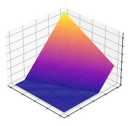

    

<h1 align="left">Artificial Intelligence</h1>

A collection of notebooks on artificial intelligence, with a focus on deep learning and data engineering.

## Projects

- [lsh](lsh/): Implementations of the *SimHash* and *MinHash* locality sensitive hash functions

## Notebooks

### Deep Learning

- [building-blocks/neuralnetworks.ipynb](building-blocks/neuralnetworks.ipynb): Neural networks: building blocks
- [building-blocks/nonlinearity.ipynb](building-blocks/nonlinearity.ipynb): A visualization of the effects of non-linearities on decision surfaces

### Data Engineering

- [ann/ann.ipynb](ann/ann.ipynb): An overview of approximate nearest neighbor search methods
